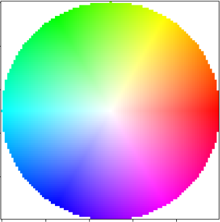
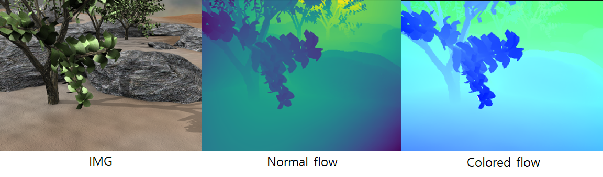

## Opticalflow visualization

This project provides visualization of the optical flow. 

for visualization, the direction of optical flow is set to H and the length of the optical flow is set to S in HSV space. and then, it restored to RGB. 

The visualization of all flows can be made with the following code.

```python
flow = np.zeros([1000,1000,2])
for i in range(1000):
    for j in range(1000):
        flow[i,j,1] = (i-500)/500.
        flow[i,j,0] = (j-500)/500.
flow = flow.astype(np.float)
visualize_flow(flow)
```






This visualization method allows you to get a better intuition about the flow.

The test for testing was taken from middlebury. (https://vision.middlebury.edu/flow/data/)
Also, the middlebury flow read function implemented in C++ was ported to python

